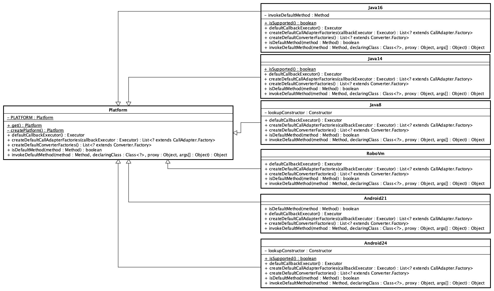
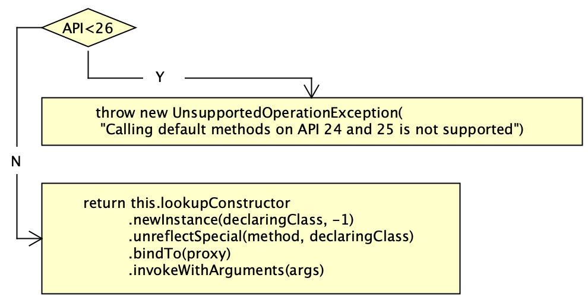
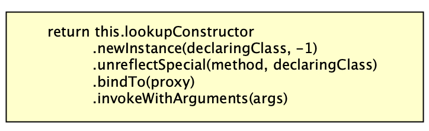
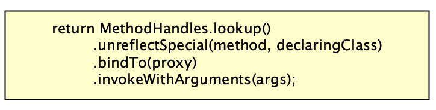
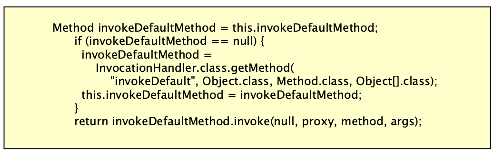

### Retrofit

#### Platform

加上此类的目的：

- 判断接口中是否有默认方法
- 如果是接口中默认方法声明的API请求，会调用对应平台`invokeDefaultMethod` 方法

1. 类图如下



通过获取系统属性 `java.vm.name`的值： `System.getProperty("java.vm.name")`，判断是哪个平台，值和平台的对应关系：

|                java.vm.name                 |                 platform                  |
| :-----------------------------------------: | :---------------------------------------: |
|                   Dalvik                    |   Android21(Build.VERSION.SDK_INT < 24)   |
|                   Dalvik                    |  Android24(Build.VERSION.SDK_INT >= 24)   |
|                   RoboVM                    |                  RoboVm                   |
| Java XXX(Java HotSpot(TM) 64-Bit Server VM) |                   Java8                   |
| Java XXX(Java HotSpot(TM) 64-Bit Server VM) | Java14(Runtime#version()#feature() >=14)  |
| Java XXX(Java HotSpot(TM) 64-Bit Server VM) | Java16(Runtime#version()#feature() >= 16) |

2. 具体判断逻辑如下：

- Java14

```java
private static final class Java14 extends Platform {
  static boolean isSupported() {
  	try {
        Object version = Runtime.class.getMethod("version").invoke(null);
        Integer feature = (Integer) version.getClass().getMethod("feature").invoke(version);
        return feature >= 14;
      } catch (InvocationTargetException | IllegalAccessException | NoSuchMethodException ignored) {
        return false;
      }
  }
}
```

- Java16

```java
private static final class Java16 extends Platform {
	static boolean isSupported() {
      try {
        Object version = Runtime.class.getMethod("version").invoke(null);
        Integer feature = (Integer) version.getClass().getMethod("feature").invoke(version);
        return feature >= 16;
      } catch (InvocationTargetException | IllegalAccessException | NoSuchMethodException ignored) {
        return false;
      }
    }
}
```

- Android24

```java
private static final class Android24 extends Platform {
  static boolean isSupported() {
      return Build.VERSION.SDK_INT >= 24;
    }
}
```

3. 模板方法不同平台的实现

   - defaultCallbackExecutor

   |          Platform          | defaultCallbackExecutor |
   | :------------------------: | :---------------------: |
   |          Android           |   MainThreadExecutor    |
   | Java8/Java14/Java16/RoboVM |          NULL           |

   MainThreadExecutor源码如下：

   ```java
   private static final class MainThreadExecutor implements Executor {
       static final Executor INSTANCE = new MainThreadExecutor();
   
       private final Handler handler = new Handler(Looper.getMainLooper());
   
       @Override
       public void execute(Runnable r) {
         handler.post(r);
       }
     }
   ```

   - createDefaultCallAdapterFactories

   |      Platform       | createDefaultCallAdapterFactories(callbackExecutor: Executor) |
   | :-----------------: | :----------------------------------------------------------: |
   |   Android(API<24)   |         DefaultCallAdapterFactory(callbackExecutor)          |
   |  Android(API>=24)   | DefaultCallAdapterFactory(callbackExecutor)<br/>`CompletableFutureCallAdapterFactory(callbackExecutor)` |
   |       RoboVM        |         DefaultCallAdapterFactory(callbackExecutor)          |
   | Java8/Java14/Java16 | DefaultCallAdapterFactory(callbackExecutor)<br/>`CompletableFutureCallAdapterFactory(callbackExecutor)` |

   - createDefaultConverterFactories

   |      Platform       | createDefaultConverterFactories |
   | :-----------------: | :-----------------------------: |
   |   Android(API<24)   |     Collections.emptyList()     |
   |  Android(API>=24)   |    OptionalConverterFactory     |
   |       RoboVM        |     Collections.emptyList()     |
   | Java8/Java14/Java16 |    OptionalConverterFactory     |

   - isDefaultMethod(method: Method)

   |      Platform       | isDefaultMethod(method: Method) |
   | :-----------------: | :-----------------------------: |
   |   Android(API<24)   |              false              |
   |  Android(API>=24)   |       method.isDefault()        |
   |       RoboVM        |              false              |
   | Java8/Java14/Java16 |       method.isDefault()        |

   - invokeDefaultMethod

   |      Platform      |                     invokeDefaultMethod                      |
   | :----------------: | :----------------------------------------------------------: |
   |  Android(API<24)   |                  throw new AssertionError()                  |
   | Android(API >= 24) |  |
   |       RoboVM       |                  throw new AssertionError()                  |
   |       Java8        |  |
   |       Java14       |  |
   |       Java16       |  |

#### 