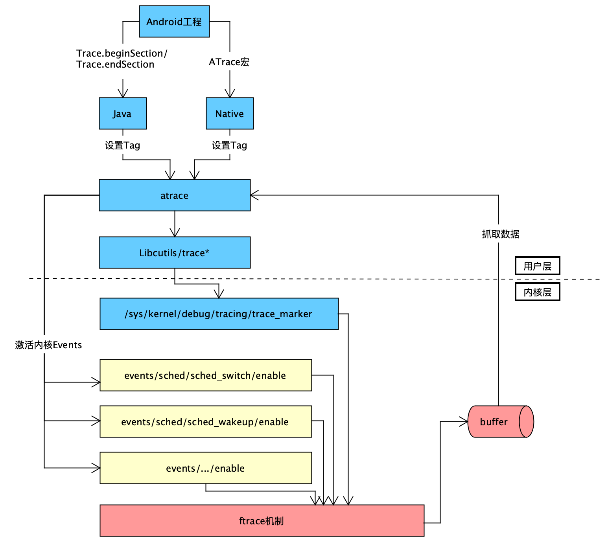

## Systrace工具使用

#### 1. Systrace是啥？

> Systrace是**android性能调试优化**的常用工具，它可以收集进程的活动信息，如界面布局、UI渲染、binder通信等；也可以收集内核信息，如cpu调度、IO活动、中断等；这些信息会统一时间轴，在Chrome浏览器中显示出来，非常方便工程师性能调试、优化卡顿等工作。
>
> [官方说明及使用文档](https://source.android.google.cn/devices/tech/debug/systrace)

#### 2. Systrace原理

Systrace是基于ftrace实现的，而ftrace 是 Linux 内核中的调试跟踪机制。

具体执行流程如下图：



> 上图中，蓝色图块表示**用户层函数调用**,  黄色图块表示**内核态事件信息**

​		Systrace抓取的trace数据，总体上可以分为两类，一类是Java和Native在用户层发生的函数调用，一类是内核态的事件信息。用户层的函数调用，其实最终事件记录都是同一个文件节点/sys/kernel/debug/tracing/trace_marker。此节点允许用户层写入字符串，ftrace会记录该写入操作时的时间戳，当用户在上层调用不同函数时，写入不同的调用信息，比如函数进入和退出分别写入，那么ftrace就可以记录跟踪函数的运行时间。atrace在处理用户层的多种trace类别时，仅仅是激活不同的TAG，如用户选择了Input类别，则激活ATRACE_TAG_INPUT；选中Graphics则激活ATRACE_TAG_GRAPHICS，记录调用的流程都是一样的，最终都是记录到trace_marker。内核态的事件信息，则不是统一的，需要激活各自对应的事件节点，让ftrace记录下不同事件的tracepoint。
例如激活进程调度信息记录，需要激活如下相关节点：
**events/sched/sched_switch/enable**
**events/sched/sched_wakeup/enable**
内核在运行时，根据节点的使能状态，会往ftrace缓冲中打点记录事件。
最终，上述两类事件记录都汇集到同一缓冲中，然后atrace工具会回读抓取，保存下来就是原始的systrace信息。原始的systrace信息再经过chrome浏览器自带的解析引擎对数据进行渲染。

#### 3. Systrace/TraceView/Profiler比较

##### 3.1 TraceView

###### 3.1.1 使用

- 在问题的起始点执行`android.os.Debug`类的如下函数之一：

  ```java
  /**
   * - 默认名字：dmtrace.trace
   * - 默认路径：应用的外存储目录->Context#getExternalFilesDir(String name)
   */
  Debug.startMethodTracing();
  ```

  ```java
  /**
   * - 默认名字：dmtrace.trace
   * - 默认路径：应用的外存储目录->Context#getExternalFilesDir(String name)
   */
  Debug.startMethodTracing (String tracePath)
  ```

  

- 在问题的结束位置执行`android.os.Debug`类的停止方法

  

##### 3.3 Systrace

#### 4. Systrace的使用


